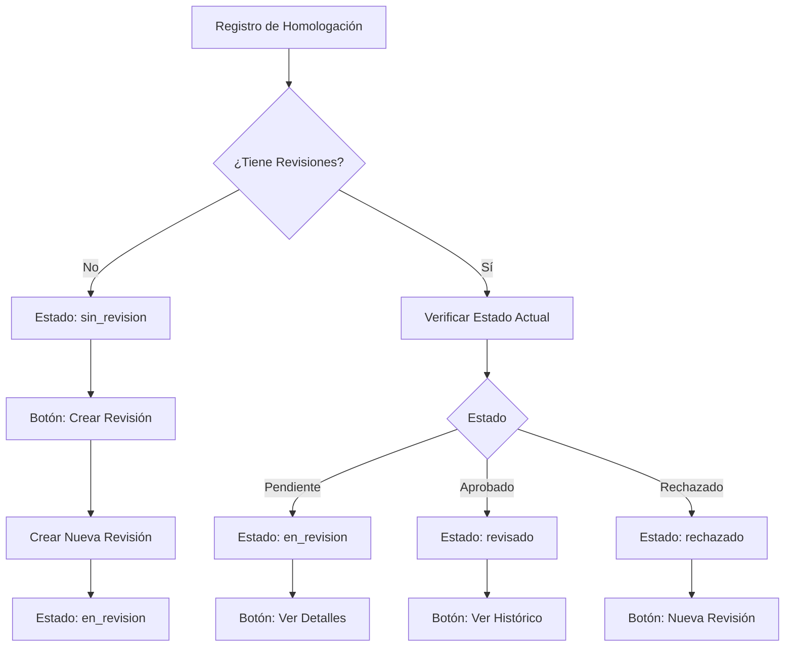

# 📋 Sistema de Revisiones Integrado - Flujo Completo

## 🎯 Objetivo
Integrar el sistema de revisiones con el módulo de homologaciones existente para permitir la revisión automática de registros de terrenos y rentas.

## 🔄 Flujo del Sistema

### 1. **Verificación Automática de Revisiones**

Cuando un usuario accede a un registro de homologación existente:

```typescript
// El hook useRevisionIntegration se ejecuta automáticamente
const { revisionInfo, isLoading } = useRevisionIntegration({
  recordType: 'terreno', // o 'renta'
  recordId: 123,
  enabled: true
});
```

**¿Qué hace?**
- Verifica si el registro tiene revisiones asociadas
- Obtiene el estado actual de las revisiones
- Calcula estadísticas (pendientes, completadas, rechazadas)
- Determina permisos de usuario

### 2. **Estados de Revisión**

| Estado | Descripción | Acciones Disponibles |
|--------|-------------|---------------------|
| `sin_revision` | No hay revisiones creadas | Crear nueva revisión |
| `en_revision` | Revisión en progreso | Ver detalles, actualizar |
| `revisado` | Revisión completada exitosamente | Ver histórico |
| `rechazado` | Revisión rechazada | Ver motivos, crear nueva |

### 3. **Integración con Módulo Existente**

#### **Paso 1: Verificación de Estado**
```http
GET /api/revisiones/status/homologacion/{id}?tipo=terreno
```

**Respuesta:**
```json
{
  "revision_id": 123,
  "status": "en_revision",
  "has_revisions": true,
  "pending_count": 2,
  "completed_count": 5,
  "rejected_count": 1,
  "last_review_date": "2024-01-15T10:30:00Z",
  "last_reviewer": "Juan Pérez",
  "can_review": true
}
```

#### **Paso 2: Creación de Nueva Revisión**
```http
POST /api/revisiones/
Content-Type: application/json

{
  "key": "homologacion_terreno_123",
  "tipo": "terreno",
  "id": 123,
  "username": "current_user",
  "descripcion": "Revisión para terreno 123",
  "metadatos": {
    "record_type": "terreno",
    "record_id": 123,
    "created_from": "homologacion_module"
  }
}
```

### 4. **Componentes de la Integración**

#### **A. Hook Principal: `useRevisionIntegration`**
```typescript
const {
  revisionInfo,        // Información completa de revisiones
  isLoading,          // Estado de carga
  error,              // Errores de la API
  refreshRevisionStatus,  // Refrescar estado manualmente
  createRevision,     // Crear nueva revisión
  hasPermissionToReview  // Permisos del usuario
} = useRevisionIntegration({
  recordType: 'terreno',
  recordId: 123
});
```

#### **B. Componente de Visualización: `RevisionStatusDisplay`**
```tsx
<RevisionStatusDisplay
  recordType="terreno"
  recordId={123}
  showCreateButton={true}
  onRevisionCreated={() => console.log('Revisión creada')}
/>
```

#### **C. Badge Compacto: `RevisionStatusBadge`**
```tsx
<RevisionStatusBadge 
  recordType="terreno" 
  recordId={123} 
/>
```

## 🔧 Implementación en Módulos Existentes

### **Modificación Mínima en Homologaciones**

1. **Agregar el componente de revisión al layout:**
```tsx
import { RevisionStatusDisplay } from '@/components/revision/RevisionStatusDisplay';

// En tu componente de homologación existente
function HomologacionPage({ recordId, recordType }) {
  return (
    <div className="grid grid-cols-3 gap-6">
      {/* Tu contenido existente */}
      <div className="col-span-2">
        {/* Formulario de homologación actual */}
      </div>
      
      {/* Panel de revisiones (NUEVO) */}
      <div className="col-span-1">
        <RevisionStatusDisplay
          recordType={recordType}
          recordId={recordId}
        />
      </div>
    </div>
  );
}
```

2. **Agregar badge en listados:**
```tsx
// En listas de homologaciones
{homologaciones.map(record => (
  <div key={record.id} className="flex items-center gap-2">
    <span>{record.title}</span>
    <RevisionStatusBadge 
      recordType={record.type} 
      recordId={record.id} 
    />
  </div>
))}
```

## 🚀 Backend - Endpoints Principales

### **1. Verificar Estado de Revisión**
```python
@revisiones_bp.route('/status/homologacion/<int:record_id>', methods=['GET'])
def get_homologacion_revision_status(record_id):
    """Verifica si un registro de homologación tiene revisiones"""
    record_type = request.args.get('tipo', 'terreno')
    key = f"homologacion_{record_type}_{record_id}"
    
    revision = RevisionData.query.filter_by(key=key).first()
    
    if not revision:
        return jsonify({
            'has_revisions': False,
            'status': 'sin_revision',
            'pending_count': 0,
            'completed_count': 0,
            'rejected_count': 0
        })
    
    # Calcular estadísticas...
    return jsonify(revision_status)
```

### **2. Crear Nueva Revisión**
```python
@revisiones_bp.route('/', methods=['POST'])
def create_revision():
    """Crea una nueva revisión"""
    data = request.get_json()
    
    # Validar datos
    schema = RevisionDataCreateSchema()
    result = schema.load(data)
    
    # Crear revisión
    revision = RevisionService.create_revision(result)
    
    return jsonify(revision), 201
```

## 📊 Flujo de Estados Detallado



## 🔐 Permisos y Seguridad

### **Matriz de Permisos**
| Rol | Crear Revisión | Ver Estado | Aprobar | Rechazar |
|-----|---------------|------------|---------|----------|
| Usuario | ✅ | ✅ | ❌ | ❌ |
| Supervisor | ✅ | ✅ | ✅ | ✅ |
| Admin | ✅ | ✅ | ✅ | ✅ |

### **Validaciones**
- Solo usuarios autenticados pueden crear revisiones
- Los supervisores pueden aprobar/rechazar
- No se puede modificar revisiones de otros usuarios sin permisos

## 📱 Casos de Uso

### **Caso 1: Usuario consulta registro existente**
1. Usuario navega a `/homologacion?tipo=terreno&id=123`
2. Sistema carga datos de homologación
3. Componente de revisión verifica automáticamente estado
4. Muestra badge y panel lateral con información

### **Caso 2: Usuario crea nueva revisión**
1. Usuario ve que el registro no tiene revisiones
2. Hace clic en "Nueva Revisión"
3. Sistema crea revisión con key `homologacion_terreno_123`
4. Redirige a página de revisión detallada

### **Caso 3: Supervisor revisa registro**
1. Supervisor accede al registro
2. Ve que hay revisión pendiente
3. Hace clic en "Ver Detalles"
4. Puede aprobar, rechazar o solicitar cambios

## 🎨 Personalización Visual

### **Colores por Estado**
- **Sin Revisión**: Gris (`bg-gray-50`)
- **En Revisión**: Azul (`bg-blue-50`)
- **Revisado**: Verde (`bg-green-50`)  
- **Rechazado**: Rojo (`bg-red-50`)

### **Iconos**
- **Sin Revisión**: `FileText`
- **En Revisión**: `Clock`
- **Revisado**: `CheckCircle`
- **Rechazado**: `XCircle`

## 🧪 Testing

### **Frontend**
```typescript
// Test del hook
test('useRevisionIntegration loads revision status', async () => {
  const { result } = renderHook(() => 
    useRevisionIntegration({
      recordType: 'terreno',
      recordId: 123
    })
  );
  
  await waitFor(() => {
    expect(result.current.revisionInfo).toBeTruthy();
  });
});
```

### **Backend**
```python
# Test del endpoint
def test_get_revision_status():
    response = client.get('/api/revisiones/status/homologacion/123?tipo=terreno')
    assert response.status_code == 200
    assert 'has_revisions' in response.json
```

## 🚀 Despliegue

1. **Backend**: Agregar rutas de revisión al Blueprint principal
2. **Frontend**: Importar componentes en módulos existentes
3. **Base de Datos**: Ejecutar migraciones para tablas de revisión
4. **Configuración**: Ajustar permisos de usuario

---

**¡El sistema está listo para integrarse seamlessly con tus módulos existentes de homologación!** 🎉
